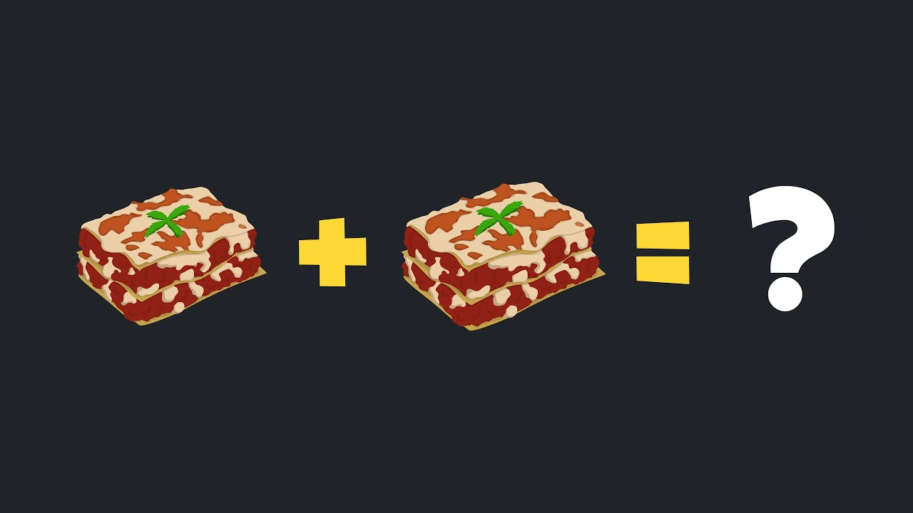

# The Mathematics of Lasagne

*Lasagne. What is it? Why is it? This talk seeks to obfuscate the answer to these questions.*

## Watch it on YouTube

## Abstract

We introduce a system for categorising foodstuffs based on the location of their starch content (the cube rule of food), give a brief introduction to Group Theory, then combine this knowledge to mathematically define Lasagne, and write a representation of it in Haskell.
