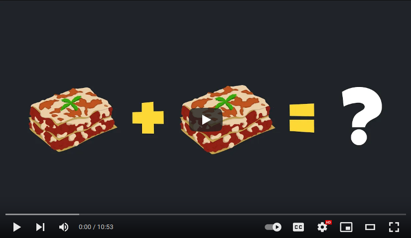

# The Mathematics of Lasagne

*Lasagne. What is it? Why is it? This talk seeks to obfuscate the answer to these questions.*

## Watch it on YouTube

## Abstract

We introduce a system for categorising foodstuffs based on the location of their starch content (The Cube Rule of Food Identification [^1]), give a brief introduction to Group Theory, then combine this knowledge to mathematically define Lasagne, and write a representation of it in Haskell.

## Why does this exist?

As part of my role as an academic officer for the [University of Warwick Computing Society](https://uwcs.co.uk/) in the 2023-24 academic year, I helped organise "Lightning Talks", which are "short (~20 minute) talks about anything and everything to do with computer science".

I wrote and delivered this talk as one of the Lightning Talks in the Michaelmas term of 2023. The slides [^2] and source code [^3] for this talk are available in this repository on GitHub, and a blog post on the topic is available on my website [^4].

[^1]: [https://cuberule.com/](https://cuberule.com/)
[^2]: [https://github.com/EdmundGoodman/The-Mathematics-of-Lasagne/files/13572864/The_Mathematics_of_Lasagne.pdf](https://github.com/EdmundGoodman/The-Mathematics-of-Lasagne/files/13572864/The_Mathematics_of_Lasagne.pdf)
[^3]: [https://github.com/EdmundGoodman/The-Mathematics-of-Lasagne/blob/main/code/lasagne.hs](https://github.com/EdmundGoodman/The-Mathematics-of-Lasagne/blob/main/code/lasagne.hs) 
[^4]: [https://edmundgoodman.co.uk/posts/2023/11/the-mathematics-of-lasagne/](https://edmundgoodman.co.uk/posts/2023/11/the-mathematics-of-lasagne/)
